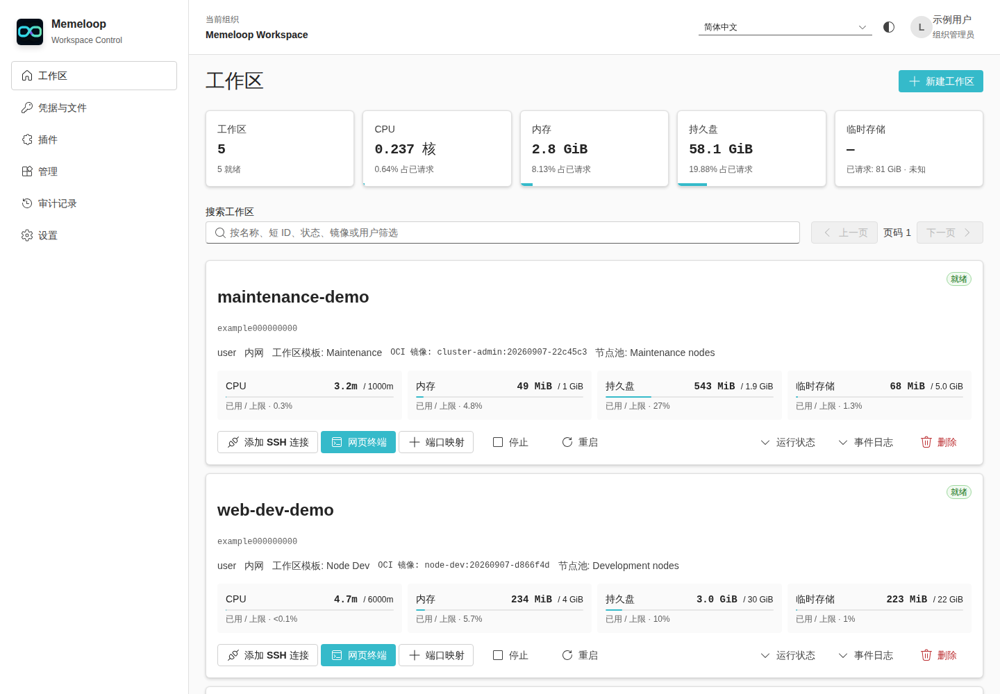
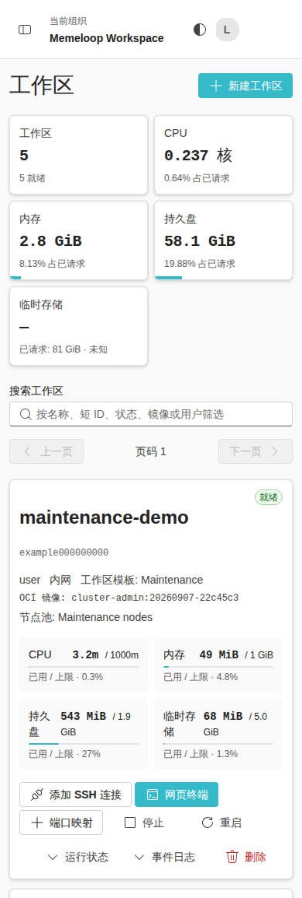
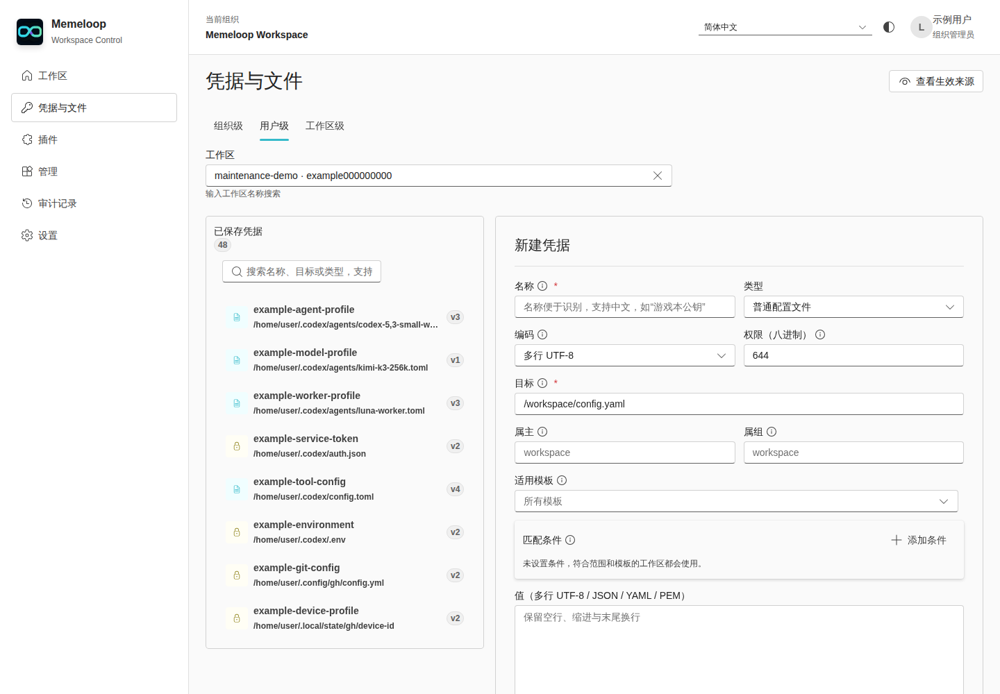

# Memeloop Workspace Control

[中文](#中文) | [English](#english)



<details>
<summary>Mobile workspace view / 移动端工作区</summary>



</details>

## 中文

Memeloop Workspace Control（MWC）是一个 Kubernetes 工作区控制面：通过经过评审的
模板和镜像白名单交付隔离的按用户开发工作区，在启动时注入凭据与文件，并通过
SSH、网页终端和带鉴权的端口映射提供访问。

## 功能

- **工作区生命周期** —— 基于模板的创建、启动、停止、重启、删除；持久 Home 卷、
  受限临时存储与节点池调度。
- **凭据与文件注入** —— 组织 / 用户 / 工作区三级级联，静态加密，支持组织锁定项。
- **工作区访问** —— 按部署与模板启用 OpenSSH、网页终端和鉴权 HTTPS 端口映射。
- **管理面** —— 镜像白名单（Image Contract v1）、模板、组织与成员、两级配额、
  审计日志。
- **API 优先** —— 细粒度 scope 的 API 密钥、游标分页、SSE 事件、签名 Webhook、
  OpenAPI 契约。
- **WebAssembly 插件** —— 创建策略、API 中间件、自定义路由与控制台界面，
  基于版本化 WIT 接口。

凭据编辑器区分普通配置与敏感值，支持组织、用户和工作区三级作用域：



## 文档

中英双语产品文档站（GitHub Pages）：
<https://memeloop-online.github.io/memeloop-workspace-control/>

- [快速开始](docs/quickstart.md)
- [工作区](docs/workspaces.md) · [凭据与文件](docs/credentials-and-files.md) · [访问](docs/access.md)
- [管理](docs/administration.md) · [API](docs/api.md) · [插件开发](docs/plugin-development.md)
- [安全模型](docs/security-model.md) · [常见问题](docs/faq.md)

## 快速开始

```bash
cargo run -- \
  --installation-id demo \
  --listen-address 127.0.0.1:8080 \
  --database-url 'sqlite://data/control-plane.sqlite?mode=rwc' \
  --instance-id local
```

生产部署使用 `deploy/helm/memeloop-workspace-control` Helm Chart；加密注入与
Webhook 需要 `MWC_ENCRYPTION_KEY` 和 `MWC_INTERNAL_AUTH_TOKEN`（从 Secret 注入）。
完整步骤见[快速开始文档](docs/quickstart.md)。

## 许可证

见 [LICENSE](LICENSE)。

## English

Memeloop Workspace Control is a Kubernetes control plane for isolated, per-user
development workspaces: reviewed templates and an image allowlist, encrypted credential and
file injection, and access over SSH, a browser terminal, and authenticated port
mappings — plus scoped API keys and sandboxed WebAssembly plugins.

## Features

- **Workspace lifecycle** — create, start, stop, restart, and delete workspaces
  from templates, with durable home volumes, bounded temporary storage, and
  node-pool placement.
- **Credentials and files** — organization, user, and workspace scopes with
  encrypted storage and locked organization items.
- **Workspace access** — OpenSSH, a browser terminal, and authenticated HTTPS
  port mappings when enabled by the deployment and template.
- **Administration** — image allowlist, templates, organizations, members,
  quotas, and audit events.
- **API** — scoped API keys, cursor pagination, SSE events, signed webhooks,
  and an OpenAPI contract.
- **WebAssembly plugins** — creation policies, API middleware, custom routes,
  and console surfaces through a versioned WIT interface.

The credential editor separates regular configuration from protected values
across organization, user, and workspace scopes.

## Documentation

Bilingual documentation is published at
<https://memeloop-online.github.io/memeloop-workspace-control/>.

- [Quick start](docs/quickstart.md)
- [Workspaces](docs/workspaces.md) · [Credentials and files](docs/credentials-and-files.md) · [Access](docs/access.md)
- [Administration](docs/administration.md) · [API](docs/api.md) · [Plugin development](docs/plugin-development.md)
- [Security model](docs/security-model.md) · [FAQ](docs/faq.md)

## Quick start

```bash
cargo run -- \
  --installation-id demo \
  --listen-address 127.0.0.1:8080 \
  --database-url 'sqlite://data/control-plane.sqlite?mode=rwc' \
  --instance-id local
```

Use the Helm chart in `deploy/helm/memeloop-workspace-control` for Kubernetes
deployments. See the [quick-start guide](docs/quickstart.md) for initial user
creation and platform setup.

## License

See [LICENSE](LICENSE).
